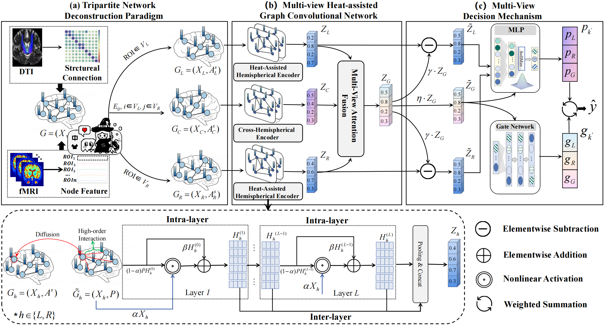

# Lateralization-aware Multi-View High-Order Graph Learning for Brain Disorder Classification
## Framework


## Abstract
Brain networks have become a fundamental tool for investigating brain organization and supporting brain disorder classification. 
Recent graph neural network (GNN)-based methods have shown promise for brain network analysis, 
yet most treat the brain as a homogeneous system, largely overlooking the lateralized heterogeneity introduced by hemispheric
asymmetry in the brain. Moreover, conventional message-passing schemes primarily rely on direct neighbors, limiting their
ability to capture high-order synergistic interactions among distant brain regions. To address these challenges, 
we propose a Lateralization-aware Multi-View High-order Graph Learning (LMHGL) framework for brain disorder classification. 
Specifically, based on hemispheric asymmetry, we first partition each brain network into left-, right-, and
cross-hemispheric subnetwork views to explicitly model lateralized heterogeneity. 
Each view is then encoded by a dedicated encoder to extract view-specific subnetwork embeddings and merged into a global brain 
representation, upon which inter-view complementarity is exploited to support collaborative decision-making. 
In particular, anatomically constrained heat diffusion is applied to the left- and right-hemispheric views to model high-order 
inter-regional dependencies associated with synergistic brain activities. Extensive experiments on three public brain disorder
datasets demonstrate that the proposed LMHGL consistently outperforms recent baseline methods. The results indicate that
explicitly modeling hemispheric asymmetry and high-order interactions is beneficial for learning biologically plausible and
discriminative brain network representations.

## Dataset
We evaluate our model on three datasets, including two publicly available cohorts and one in-house clinical collection. Each dataset contains paired resting-state fMRI (rs-fMRI) and diffusion tensor imaging (DTI) scans. The datasets are described as follows.

(1) The Alzheimer’s Disease Neuroimaging Initiative (ADNI) dataset\footnote comprises 166 subjects, including 115 healthy controls (HCs) and 51 individuals diagnosed with mild cognitive impairment (MCI), with imaging acquired from the ADNI2 and ADNI3 phases.

(2) The Parkinson’s Progression Markers Initiative (PPMI) dataset\footnote includes 146 subjects, consisting of 98 NCs and 48 patients with Parkinson’s disease (PD).

(3) The post-stroke cognitive impairment (PSCI) dataset was collected in-house at the Department of Neuroradiology, Inner Mongolia People's Hospital\footnote, and comprises 48 subjects, including 28 NCs and 20 clinically diagnosed stroke disease (SD).

All imaging data were parcellated using the AAL atlas, which defines 116 ROIs: 90 cerebral and 26 cerebellar regions. For the ADNI and PSCI datasets, only the 90 cerebral ROIs were retained to mitigate potential noise introduced by cerebellar signals, whereas all 116 ROIs were preserved for PPMI, as cerebellar involvement may contribute to Parkinsonian motor and non-motor manifestations. Detailed demographic and clinical information, including gender distribution and deviation age (mean/standard), is summarized in Table 1.

<table>
  <caption><strong>Table 1: Details of the subjects</strong></caption>
  <thead>
    <tr>
      <th rowspan="2">Dataset</th>
      <th rowspan="2">Group</th>
      <th rowspan="2">Number</th>
      <th colspan="2">Sex</th>
      <th rowspan="2">Age (Mean ± SD)</th>
    </tr>
    <tr>
      <th>Male</th>
      <th>Female</th>
    </tr>
  </thead>
  <tbody>
    <tr>
      <td rowspan="2">ADNI</td>
      <td>Normal Control</td>
      <td>115</td>
      <td>85</td>
      <td>30</td>
      <td>88 ± 5.1</td>
    </tr>
    <tr>
      <td>Mild Cognitive Impairment</td>
      <td>51</td>
      <td>33</td>
      <td>18</td>
      <td>72.5 ± 16.5</td>
    </tr>
    <tr>
      <td rowspan="2">PPMI</td>
      <td>Normal Control</td>
      <td>98</td>
      <td>67</td>
      <td>31</td>
      <td>62 ± 10</td>
    </tr>
    <tr>
      <td>Parkinson</td>
      <td>48</td>
      <td>35</td>
      <td>13</td>
      <td>64 ± 11</td>
    </tr>
    <tr>
      <td rowspan="2">PSCI</td>
      <td>Normal Control</td>
      <td>28</td>
      <td>16</td>
      <td>12</td>
      <td>76 ± 6.1</td>
    </tr>
    <tr>
      <td>Stroke</td>
      <td>20</td>
      <td>15</td>
      <td>5</td>
      <td>77 ± 5.3</td>
    </tr>
  </tbody>
</table>

## Data Preprocessing
All datasets (ADNI, PPMI, and PSCI) were preprocessed using a unified pipeline to ensure consistency across imaging modalities and subject cohorts. 

For rs-fMRI data, preprocessing was conducted using DPARSF 5.4 (https://rfmri.org/DPABI) and SPM12 (https://www.fil.ion.ucl.ac.uk/spm/). 
Raw DICOM images were first converted to NIfTI format, and the initial 10 volumes were discarded to allow for signal stabilization. Slice timing correction and head motion realignment were then applied.
All volumes were spatially normalized to MNI space using the EPI template and
resampled to $3 \times 3 \times 3~\text{mm}^3$ resolution. Spatial smoothing was performed using a 4 mm FWHM Gaussian kernel.
Temporal preprocessing included linear trend removal and band-pass filtering (0.01–0.1 Hz) to suppress low-frequency drifts and high-frequency 
physiological noise. Subsequently, the brain was parcellated using the AAL atlas, and mean BOLD time series were extracted from 
each ROI to construct functional node features. 

For DTI data, preprocessing followed the PANDA toolbox, which integrates standard 
steps for diffusion correction, registration, and tractography. After skull stripping and correction of motion and eddy-current artifacts, 
deterministic tractography was performed using the FACT algorithm \cite{FACT}, which propagates streamlines along principal diffusion directions. 
Tracking was constrained by a 45° angular threshold and terminated when the fractional anisotropy (FA) value fell below 0.2 or exceeded 1.0. To reduce noise, white matter streamlines were spatially smoothed. Structural connectivity was quantified by computing the mean FA values along streamlines between each pair of AAL-defined ROIs, yielding a weighted adjacency matrix that serves as the structural backbone of the brain network.

## Code:
### Model Input:
- **Initial Node Feature Matrix \( X ∈ R^(n×d) \)**:
  - This matrix represents the raw fMRI BOLD signals of a subject.
  - \( n \) is the number of ROIs (regions of interest).
  - \( d \) represents the length of each ROI's time series.
- **Weighted Adjacency Matrix \( A ∈ R^(n×n)  \)**:
  - This matrix describes the connection strengths among ROIs.
  - \( A_{ij} \in [0,1] \) represents the fractional anisotropy (FA) value between the \( i \)-th and \( j \)-th ROIs.
  - **FA Value Interpretation**:
    - Higher FA values indicate more ordered and intact fiber tracts.
    - An FA value closer to 1 suggests stronger and more coherent fiber connections between the two ROIs.
    - A value closer to 0 indicates weaker or more disordered connections.
### dataUtils.py
This file encompasses the loading of datasets and the normalization of graph structures. 
For instance, it involves reading preprocessed brain networks and performing symmetric normalization on these networks.
### train.py
You need to run this file to start. All the hyper-parameters can be defined in this file.
```
python train.py
```